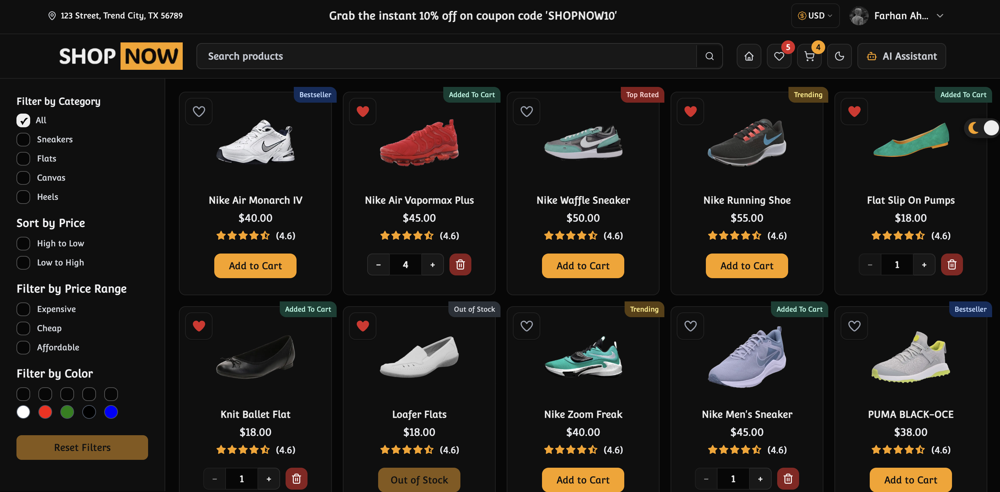

# 👟 ShopNow – Full-Stack Shoe Hunt Platform

ShopNow is a **high-performance, frontend-focused full-stack shoe discovery and listing application** designed for real-world shopping flows. Built with a strong emphasis on usability, accessibility, and speed, it leverages **Next.js** for the frontend and API routes, with **Supabase** handling authentication and database management.

The application is engineered to handle large product datasets efficiently using **list virtualization** and includes a **context-aware AI assistant** to enhance product discovery and user decision-making.

---

## 🚀 Key Features

### 🛍️ Core Shopping Experience

- **Search-Driven Navigation**  
  A global search bar available in the header on every page. Searching routes users directly to **dynamic product detail pages**.

- **Advanced Filtering**  
  Sidebar-based filtering by brand, size, color, and price range, implemented using **custom React hooks** for clean and reusable state management.

- **Dynamic Product Pages**  
  SEO-friendly, server-rendered product detail pages using dynamic routing.

- **Cart & Wishlist**  
  Dedicated routes for managing cart and wishlist items with instant UI feedback.

---

### 🧠 Smart & Interactive

- **Context-Aware AI Assistant**  
  Implemented using a **shadcn Sheet (drawer)**, allowing users to ask product-related questions and receive insights without leaving the current page.

- **Optimistic UI Updates**  
  Actions like _Add to Cart_ and _Add to Wishlist_ update the UI instantly using **Redux Toolkit**, while **Redux Saga** handles API calls and side effects in the background.

- **User Feedback System**  
  Non-intrusive **toast notifications** provide clear success and failure feedback for user actions.

---

### 🔐 Authentication & Data Sync

- **Modal-Based Authentication**  
  Login and signup flows are handled via accessible modals, preserving user context without page redirects.

- **Supabase Integration**  
  Secure authentication and user management using Supabase Auth.

- **Automatic Data Synchronization**  
  Guest cart and wishlist data are automatically merged with persistent backend data when a user logs in.

---

### ⚡ Performance & Engineering

- **List Virtualization**  
  Ensures smooth 60fps scrolling even with large product lists.

- **Loading Skeletons**  
  Improve perceived performance during data fetching.

- **Next.js API Routes**  
  Serve as the backend layer for business logic and database communication.

---

## 🛠️ Tech Stack

### Frontend

- **Framework:** Next.js (App Router)
- **Language:** TypeScript
- **Styling:** Tailwind CSS
- **UI Components:** shadcn/ui
- **Icons:** Lucide React

### State Management & Async Logic

- **Global State:** Redux Toolkit
- **Side Effects:** Redux Saga (optimistic updates, async flows, error handling)

### Backend & Database

- **API Layer:** Next.js API Routes
- **Database:** Supabase (PostgreSQL)
- **Authentication:** Supabase Auth

---

## 🏗️ Architecture Highlights

### Optimistic UI with Redux Saga

1. User triggers an action (e.g., _Add to Cart_).
2. Redux updates the UI immediately.
3. A Redux Saga handles the API request in the background.
4. On success, the state is confirmed; on failure, changes are rolled back and an error toast is shown.

### Authentication Flow

Authentication is handled via modals instead of full-page redirects, allowing users to sign in or sign up without losing their current browsing context.

---

## 📂 Project Structure

```
├── public/                    # Static assets
│   └── images/                # Image assets & product images
├── scripts/                   # Database scripts & seed data
└── src/
    ├── app/                   # Next.js App Router
    │   ├── api/               # Backend API Routes
    │   │   ├── cart/          # Cart API endpoints
    │   │   ├── feedback/      # Feedback API endpoints
    │   │   ├── products/      # Products API endpoints
    │   │   └── wishlist/      # Wishlist API endpoints
    │   ├── auth/              # Auth pages & callback handler
    │   ├── cart/              # Cart page
    │   ├── products/          # Product pages
    │   │   └── [itemName]/    # Dynamic product detail pages
    │   └── wishlist/          # Wishlist page
    ├── components/            # Reusable UI components
    │   ├── ai-assistant/      # AI assistant components
    │   ├── auth/              # Authentication components
    │   ├── cart/              # Cart components
    │   ├── footers/           # Footer components
    │   ├── headers/           # Header components
    │   ├── home/              # Home page components
    │   ├── modals/            # Modal components
    │   ├── product-details/   # Product detail components
    │   ├── shared/            # Shared components
    │   ├── skeletons/         # Loading skeletons
    │   ├── ui/                # shadcn UI components
    │   └── wishlist/          # Wishlist components
    ├── config/                # App configuration
    ├── constants/             # App constants (animations, filters, routes)
    ├── hooks/                 # Custom React hooks
    ├── lib/                   # Utilities & helpers
    ├── providers/             # React context providers
    ├── redux/                 # Redux state management
    │   ├── cart/              # Cart state
    │   ├── wishlist/          # Wishlist state
    │   ├── slices/            # Redux slices
    │   └── sagas/             # Redux sagas
    ├── services/              # API service layer
    ├── styles/                # Global styles
    ├── types/                 # TypeScript types
    └── utils/                 # Utility functions
        ├── products/          # Product utilities
        ├── redux/             # Redux utilities
        └── supabase/          # Supabase utilities
```

---

## 🧭 Navigation Structure

### Header

- Global search bar accessible from all pages

### Sidebar

- Product filtering controls

### Routes

- `/` – Home page with product listings
- `/products/[itemName]` – Dynamic product detail pages
- `/cart` – Cart management
- `/wishlist` – Wishlist management

### Modals

- Login & Signup
- User feedback interactions

### Drawer (Sheet)

- Context-aware AI assistant

---

## 🎨 UI & Accessibility

- Built with **shadcn UI** and **Tailwind CSS**
- Fully responsive, pixel-perfect layout
- Dark mode support
- Accessibility best practices followed

---

## 🚀 Getting Started

### Prerequisites

- Node.js 18+ or Bun
- npm/yarn/pnpm/bun
- Supabase account (for authentication and database)

### Installation

```bash
# Clone the repository
git clone https://github.com/yourusername/shop-now.git
cd shop-now

# Install dependencies
npm install
# or
bun install

# Set up environment variables
# Create a .env.local file with:
# NEXT_PUBLIC_SUPABASE_URL=your_supabase_url
# NEXT_PUBLIC_SUPABASE_ANON_KEY=your_supabase_anon_key

# Run database migrations (optional)
bun run seed

# Start development server
npm run dev
# or
bun dev
```

Open [http://localhost:3000](http://localhost:3000) in your browser.

### Build & Deploy

```bash
# Production build
npm run build

# Start production server
npm run start

# Lint codebase
npm run lint
```

---

## 🎯 Project Focus

ShopNow is intentionally designed as a **frontend-specialized full-stack application**, prioritizing UI/UX quality, performance optimization, and scalable frontend architecture while keeping backend complexity clean and manageable. The project demonstrates strong proficiency in modern React patterns, real-world state management, and production-ready frontend engineering practices.

---

## 📄 License

MIT License – See LICENSE file for details

---

Built with ❤️ using Next.js, React, Redux, and Supabase
